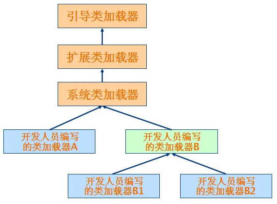

# 类加载器

类加载器加载类的层次结构图：
<div align="center">  </div><br>

## 系统提供的3类加载器:
### 1、启动类加载器(Bootstrap ClassLoader)
这个类加载器负责将<JAVA_HOME>\lib目录下的类库加载到虚拟机内存中,用来加载java的核心库,此类加载器并不继承于java.lang.ClassLoader,
不能被java程序直接调用,代码是使用C++编写的.是虚拟机自身的一部分.

### 2、扩展类加载器(Extendsion ClassLoader):
这个类加载器负责加载<JAVA_HOME>\lib\ext目录下的类库,用来加载java的扩展库,开发者可以直接使用这个类加载器.

### 3、应用程序类加载器(Application ClassLoader):
这个类加载器负责加载用户类路径(CLASSPATH)下的类库,一般我们编写的java类都是由这个类加载器加载,
这个类加载器是CLassLoader中的getSystemClassLoader()方法的返回值,所以也称为系统类加载器.一般情况下这就是系统默认的类加载器.
除此之外,我们还可以加入自己定义的类加载器,以满足特殊的需求,需要继承java.lang.ClassLoader类.


使用代码观察一下类加载器:（com.ls.classload.TestClassLoader）

```java
public class TestClassLoader {

    public static void main(String[] args) {
        ClassLoader loader = TestClassLoader.class.getClassLoader();
        System.out.println(loader.toString());
        System.out.println(loader.getParent().toString());
        System.out.println(loader.getParent().getParent());
    }
}
```


观察打印结果:
sun.misc.Launcher$AppClassLoader@500c05c2
sun.misc.Launcher$ExtClassLoader@454e2c9c
null

第一行打印的是应用程序类加载器(默认加载器);
第二行打印的是其父类加载器,扩展类加载器,按照我们的想法第三行应该打印启动类加载器的,这里却返回的null,原因是getParent(),返回时null的话,就默认使用启动类加载器作为父加载器.

## 类加载器的双亲委派模型
双亲委派模型是一种组织类加载器之间关系的一种规范,工作原理是:
如果一个类加载器收到了类加载的请求,它不会自己去尝试加载这个类,而是把这个请求委派给父类加载器去完成,这样层层递进,
最终所有的加载请求都被传到最顶层的启动类加载器中,只有当父类加载器无法完成这个加载请求(它的搜索范围内没有找到所需的类)时,才会交给子类加载器去尝试加载.
这样的好处是:java类随着它的类加载器一起具备了带有优先级的层次关系.
这是十分必要的,比如java.langObject,它存放在\jre\lib\rt.jar中,它是所有java类的父类,
因此无论哪个类加载都要加载这个类,最终所有的加载请求都汇总到顶层的启动类加载器中,因此Object类会由启动类加载器来加载,
所以加载的都是同一个类,如果不使用双亲委派模型,由各个类加载器自行去加载的话,系统中就会出现不止一个Object类,应用程序就会全乱了.

## Class.forname()与ClassLoader.loadClass()区别
Class.forname():是一个静态方法,最常用的是Class.forname(String className);根据传入的类的全限定名返回一个Class对象.该方法在将Class文件加载到内存的同时,会执行类的初始化.
如: Class.forName("com.wang.HelloWorld");

ClassLoader.loadClass():这是一个实例方法,需要一个ClassLoader对象来调用该方法,该方法将Class文件加载到内存时,并不会执行类的初始化,直到这个类第一次使用时才进行初始化.该方法因为需要得到一个ClassLoader对象,所以可以根据需要指定使用哪个类加载器.
如:ClassLoader cl=.......;cl.loadClass("com.wang.HelloWorld");


[参考](https://www.cnblogs.com/fingerboy/p/5456371.html)